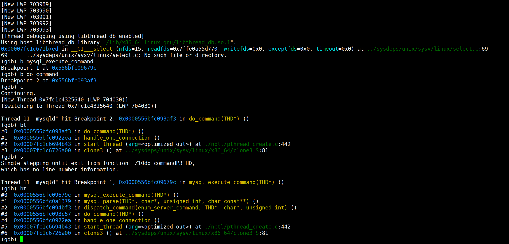
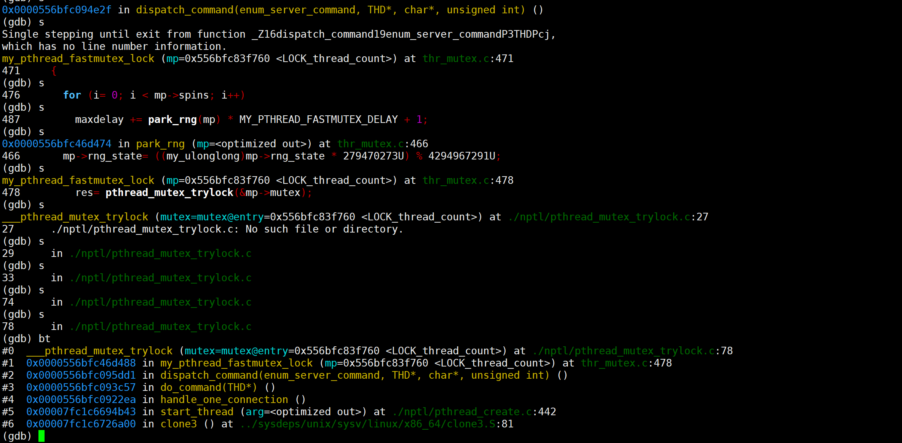
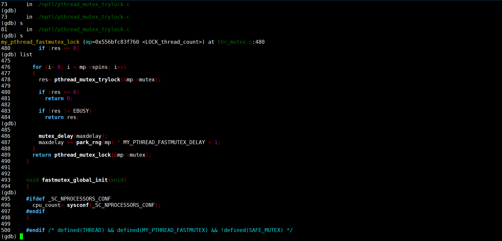
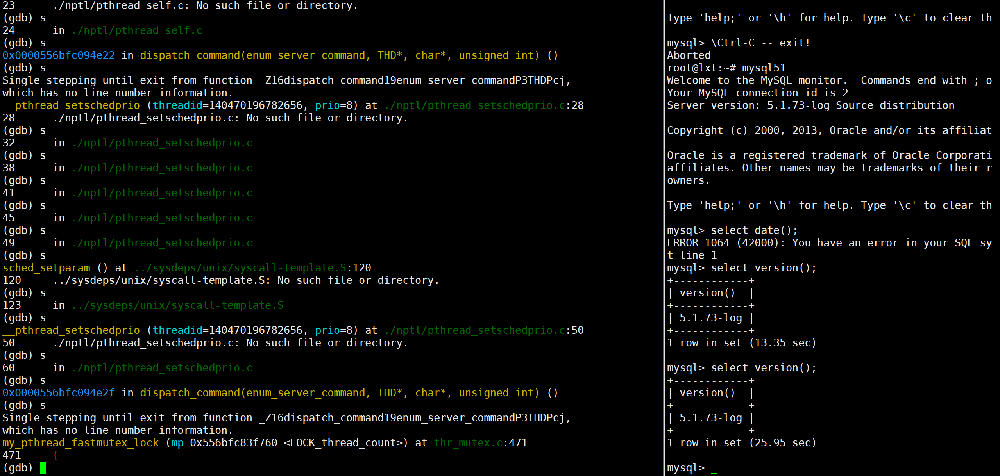

root@lxt:~# gdb attach -p 702823 
GNU gdb (Ubuntu 12.1-0ubuntu1~22.04) 12.1
Copyright (C) 2022 Free Software Foundation, Inc.
License GPLv3+: GNU GPL version 3 or later <http://gnu.org/licenses/gpl.html>
This is free software: you are free to change and redistribute it.
There is NO WARRANTY, to the extent permitted by law.
Type "show copying" and "show warranty" for details.
This GDB was configured as "x86_64-linux-gnu".
Type "show configuration" for configuration details.
For bug reporting instructions, please see:
<https://www.gnu.org/software/gdb/bugs/>.
Find the GDB manual and other documentation resources online at:
    <http://www.gnu.org/software/gdb/documentation/>.

For help, type "help".
Type "apropos word" to search for commands related to "word"...
attach: No such file or directory.
Attaching to process 702823
[New LWP 702825]
[New LWP 702826]
[New LWP 702827]
[New LWP 702828]
[New LWP 702830]
[New LWP 702831]
[New LWP 702832]
[New LWP 702833]
[New LWP 702834]
[Thread debugging using libthread_db enabled]
Using host libthread_db library "/lib/x86_64-linux-gnu/libthread_db.so.1".
0x00007f257ff1b7ed in __GI___select (nfds=15, readfds=0x7ffec2a0f9e0, writefds=0x0, exceptfds=0x0, timeout=0x0) at ../sysdeps/unix/sysv/linux/select.c:69
69	../sysdeps/unix/sysv/linux/select.c: No such file or directory.
(gdb) thread apply all bt

Thread 10 (Thread 0x7f257c2b9640 (LWP 702834) "mysqld"):
#0  0x00007f257fe4321a in __GI___sigtimedwait (set=set@entry=0x7f257c2b8dc0, info=info@entry=0x7f257c2b8cf0, timeout=timeout@entry=0x0) at ../sysdeps/unix/sysv/linux/sigtimedwait.c:61
#1  0x00007f257fe428ac in __GI___sigwait (set=0x7f257c2b8dc0, sig=0x7f257c2b8db0) at ../sysdeps/unix/sysv/linux/sigwait.c:28
#2  0x00005630c5071bbe in signal_hand ()
#3  0x00007f257fe94b43 in start_thread (arg=<optimized out>) at ./nptl/pthread_create.c:442
#4  0x00007f257ff26a00 in clone3 () at ../sysdeps/unix/sysv/linux/x86_64/clone3.S:81

Thread 9 (Thread 0x7f2575df6640 (LWP 702833) "mysqld"):
#0  __futex_abstimed_wait_common64 (private=0, cancel=true, abstime=0x0, op=393, expected=0, futex_word=0x5630c7245e68) at ./nptl/futex-internal.c:57
#1  __futex_abstimed_wait_common (cancel=true, private=0, abstime=0x0, clockid=0, expected=0, futex_word=0x5630c7245e68) at ./nptl/futex-internal.c:87
#2  __GI___futex_abstimed_wait_cancelable64 (futex_word=futex_word@entry=0x5630c7245e68, expected=expected@entry=0, clockid=clockid@entry=0, abstime=abstime@entry=0x0, private=private@entry=0) at ./nptl/futex-internal.c:139
#3  0x00007f257fe93ac1 in __pthread_cond_wait_common (abstime=0x0, clockid=0, mutex=0x5630c7245e00, cond=0x5630c7245e40) at ./nptl/pthread_cond_wait.c:503
#4  ___pthread_cond_wait (cond=cond@entry=0x5630c7245e40, mutex=mutex@entry=0x5630c7245e00) at ./nptl/pthread_cond_wait.c:627
#5  0x00005630c5302aab in os_event_wait_low (event=event@entry=0x5630c7245e00, reset_sig_count=reset_sig_count@entry=0) at os/os0sync.c:422
#6  0x00005630c5331258 in srv_master_thread (arg=<optimized out>) at srv/srv0srv.c:2811
#7  0x00007f257fe94b43 in start_thread (arg=<optimized out>) at ./nptl/pthread_create.c:442
#8  0x00007f257ff26a00 in clone3 () at ../sysdeps/unix/sysv/linux/x86_64/clone3.S:81

Thread 8 (Thread 0x7f25765f7640 (LWP 702832) "mysqld"):
#0  0x00007f257ff1b7ed in __GI___select (nfds=nfds@entry=0, readfds=readfds@entry=0x0, writefds=writefds@entry=0x0, exceptfds=exceptfds@entry=0x0, timeout=timeout@entry=0x7f25765f6de0) at ../sysdeps/unix/sysv/linux/select.c:69
#1  0x00005630c530368f in os_thread_sleep (tm=tm@entry=5000000) at os/os0thread.c:281
#2  0x00005630c532fe43 in srv_monitor_thread (arg=<optimized out>) at srv/srv0srv.c:1993
#3  0x00007f257fe94b43 in start_thread (arg=<optimized out>) at ./nptl/pthread_create.c:442
#4  0x00007f257ff26a00 in clone3 () at ../sysdeps/unix/sysv/linux/x86_64/clone3.S:81

Thread 7 (Thread 0x7f2576df8640 (LWP 702831) "mysqld"):
#0  0x00007f257ff1b7ed in __GI___select (nfds=nfds@entry=0, readfds=readfds@entry=0x0, writefds=writefds@entry=0x0, exceptfds=exceptfds@entry=0x0, timeout=timeout@entry=0x7f2576df7db0) at ../sysdeps/unix/sysv/linux/select.c:69
#1  0x00005630c530368f in os_thread_sleep (tm=tm@entry=1000000) at os/os0thread.c:281
#2  0x00005630c53304bd in srv_error_monitor_thread (arg=<optimized out>) at srv/srv0srv.c:2299
#3  0x00007f257fe94b43 in start_thread (arg=<optimized out>) at ./nptl/pthread_create.c:442
#4  0x00007f257ff26a00 in clone3 () at ../sysdeps/unix/sysv/linux/x86_64/clone3.S:81

--Type <RET> for more, q to quit, c to continue without paging--
Thread 6 (Thread 0x7f25775f9640 (LWP 702830) "mysqld"):
#0  0x00007f257ff1b7ed in __GI___select (nfds=nfds@entry=0, readfds=readfds@entry=0x0, writefds=writefds@entry=0x0, exceptfds=exceptfds@entry=0x0, timeout=timeout@entry=0x7f25775f8df0) at ../sysdeps/unix/sysv/linux/select.c:69
#1  0x00005630c530368f in os_thread_sleep (tm=tm@entry=1000000) at os/os0thread.c:281
#2  0x00005630c533019a in srv_lock_timeout_thread (arg=<optimized out>) at srv/srv0srv.c:2135
#3  0x00007f257fe94b43 in start_thread (arg=<optimized out>) at ./nptl/pthread_create.c:442
#4  0x00007f257ff26a00 in clone3 () at ../sysdeps/unix/sysv/linux/x86_64/clone3.S:81

Thread 5 (Thread 0x7f257caba640 (LWP 702828) "mysqld"):
#0  __futex_abstimed_wait_common64 (private=0, cancel=true, abstime=0x0, op=393, expected=0, futex_word=0x5630c7770c18) at ./nptl/futex-internal.c:57
#1  __futex_abstimed_wait_common (cancel=true, private=0, abstime=0x0, clockid=0, expected=0, futex_word=0x5630c7770c18) at ./nptl/futex-internal.c:87
#2  __GI___futex_abstimed_wait_cancelable64 (futex_word=futex_word@entry=0x5630c7770c18, expected=expected@entry=0, clockid=clockid@entry=0, abstime=abstime@entry=0x0, private=private@entry=0) at ./nptl/futex-internal.c:139
#3  0x00007f257fe93ac1 in __pthread_cond_wait_common (abstime=0x0, clockid=0, mutex=0x5630c7770bb0, cond=0x5630c7770bf0) at ./nptl/pthread_cond_wait.c:503
#4  ___pthread_cond_wait (cond=cond@entry=0x5630c7770bf0, mutex=mutex@entry=0x5630c7770bb0) at ./nptl/pthread_cond_wait.c:627
#5  0x00005630c5302aab in os_event_wait_low (event=0x5630c7770bb0, reset_sig_count=reset_sig_count@entry=0) at os/os0sync.c:422
#6  0x00005630c5301a54 in os_aio_simulated_handle (global_segment=global_segment@entry=3, message1=message1@entry=0x7f257cab9df0, message2=message2@entry=0x7f257cab9df8, type=type@entry=0x7f257cab9e00) at os/os0file.c:4285
#7  0x00005630c52d1fe6 in fil_aio_wait (segment=segment@entry=3) at fil/fil0fil.c:4308
#8  0x00005630c5331540 in io_handler_thread (arg=<optimized out>) at srv/srv0start.c:421
#9  0x00007f257fe94b43 in start_thread (arg=<optimized out>) at ./nptl/pthread_create.c:442
#10 0x00007f257ff26a00 in clone3 () at ../sysdeps/unix/sysv/linux/x86_64/clone3.S:81

Thread 4 (Thread 0x7f257d2bb640 (LWP 702827) "mysqld"):
#0  __futex_abstimed_wait_common64 (private=0, cancel=true, abstime=0x0, op=393, expected=0, futex_word=0x5630c7770b6c) at ./nptl/futex-internal.c:57
#1  __futex_abstimed_wait_common (cancel=true, private=0, abstime=0x0, clockid=0, expected=0, futex_word=0x5630c7770b6c) at ./nptl/futex-internal.c:87
#2  __GI___futex_abstimed_wait_cancelable64 (futex_word=futex_word@entry=0x5630c7770b6c, expected=expected@entry=0, clockid=clockid@entry=0, abstime=abstime@entry=0x0, private=private@entry=0) at ./nptl/futex-internal.c:139
#3  0x00007f257fe93ac1 in __pthread_cond_wait_common (abstime=0x0, clockid=0, mutex=0x5630c7770b00, cond=0x5630c7770b40) at ./nptl/pthread_cond_wait.c:503
#4  ___pthread_cond_wait (cond=cond@entry=0x5630c7770b40, mutex=mutex@entry=0x5630c7770b00) at ./nptl/pthread_cond_wait.c:627
#5  0x00005630c5302aab in os_event_wait_low (event=0x5630c7770b00, reset_sig_count=reset_sig_count@entry=0) at os/os0sync.c:422
#6  0x00005630c5301a54 in os_aio_simulated_handle (global_segment=global_segment@entry=2, message1=message1@entry=0x7f257d2badf0, message2=message2@entry=0x7f257d2badf8, type=type@entry=0x7f257d2bae00) at os/os0file.c:4285
#7  0x00005630c52d1fe6 in fil_aio_wait (segment=segment@entry=2) at fil/fil0fil.c:4308
#8  0x00005630c5331540 in io_handler_thread (arg=<optimized out>) at srv/srv0start.c:421
#9  0x00007f257fe94b43 in start_thread (arg=<optimized out>) at ./nptl/pthread_create.c:442
#10 0x00007f257ff26a00 in clone3 () at ../sysdeps/unix/sysv/linux/x86_64/clone3.S:81
--Type <RET> for more, q to quit, c to continue without paging--

Thread 3 (Thread 0x7f257dabc640 (LWP 702826) "mysqld"):
#0  __futex_abstimed_wait_common64 (private=0, cancel=true, abstime=0x0, op=393, expected=0, futex_word=0x5630c7770ab8) at ./nptl/futex-internal.c:57
#1  __futex_abstimed_wait_common (cancel=true, private=0, abstime=0x0, clockid=0, expected=0, futex_word=0x5630c7770ab8) at ./nptl/futex-internal.c:87
#2  __GI___futex_abstimed_wait_cancelable64 (futex_word=futex_word@entry=0x5630c7770ab8, expected=expected@entry=0, clockid=clockid@entry=0, abstime=abstime@entry=0x0, private=private@entry=0) at ./nptl/futex-internal.c:139
#3  0x00007f257fe93ac1 in __pthread_cond_wait_common (abstime=0x0, clockid=0, mutex=0x5630c7770a50, cond=0x5630c7770a90) at ./nptl/pthread_cond_wait.c:503
#4  ___pthread_cond_wait (cond=cond@entry=0x5630c7770a90, mutex=mutex@entry=0x5630c7770a50) at ./nptl/pthread_cond_wait.c:627
#5  0x00005630c5302aab in os_event_wait_low (event=0x5630c7770a50, reset_sig_count=reset_sig_count@entry=0) at os/os0sync.c:422
#6  0x00005630c5301a54 in os_aio_simulated_handle (global_segment=global_segment@entry=1, message1=message1@entry=0x7f257dabbdf0, message2=message2@entry=0x7f257dabbdf8, type=type@entry=0x7f257dabbe00) at os/os0file.c:4285
#7  0x00005630c52d1fe6 in fil_aio_wait (segment=segment@entry=1) at fil/fil0fil.c:4308
#8  0x00005630c5331540 in io_handler_thread (arg=<optimized out>) at srv/srv0start.c:421
#9  0x00007f257fe94b43 in start_thread (arg=<optimized out>) at ./nptl/pthread_create.c:442
#10 0x00007f257ff26a00 in clone3 () at ../sysdeps/unix/sysv/linux/x86_64/clone3.S:81

Thread 2 (Thread 0x7f257fdff640 (LWP 702825) "mysqld"):
#0  __futex_abstimed_wait_common64 (private=0, cancel=true, abstime=0x0, op=393, expected=0, futex_word=0x5630c7770a08) at ./nptl/futex-internal.c:57
#1  __futex_abstimed_wait_common (cancel=true, private=0, abstime=0x0, clockid=0, expected=0, futex_word=0x5630c7770a08) at ./nptl/futex-internal.c:87
#2  __GI___futex_abstimed_wait_cancelable64 (futex_word=futex_word@entry=0x5630c7770a08, expected=expected@entry=0, clockid=clockid@entry=0, abstime=abstime@entry=0x0, private=private@entry=0) at ./nptl/futex-internal.c:139
#3  0x00007f257fe93ac1 in __pthread_cond_wait_common (abstime=0x0, clockid=0, mutex=0x5630c77709a0, cond=0x5630c77709e0) at ./nptl/pthread_cond_wait.c:503
#4  ___pthread_cond_wait (cond=cond@entry=0x5630c77709e0, mutex=mutex@entry=0x5630c77709a0) at ./nptl/pthread_cond_wait.c:627
#5  0x00005630c5302aab in os_event_wait_low (event=0x5630c77709a0, reset_sig_count=reset_sig_count@entry=0) at os/os0sync.c:422
#6  0x00005630c5301a54 in os_aio_simulated_handle (global_segment=global_segment@entry=0, message1=message1@entry=0x7f257fdfedf0, message2=message2@entry=0x7f257fdfedf8, type=type@entry=0x7f257fdfee00) at os/os0file.c:4285
#7  0x00005630c52d1fe6 in fil_aio_wait (segment=segment@entry=0) at fil/fil0fil.c:4308
#8  0x00005630c5331540 in io_handler_thread (arg=<optimized out>) at srv/srv0start.c:421
#9  0x00007f257fe94b43 in start_thread (arg=<optimized out>) at ./nptl/pthread_create.c:442
#10 0x00007f257ff26a00 in clone3 () at ../sysdeps/unix/sysv/linux/x86_64/clone3.S:81

Thread 1 (Thread 0x7f25804da740 (LWP 702823) "mysqld"):
#0  0x00007f257ff1b7ed in __GI___select (nfds=15, readfds=0x7ffec2a0f9e0, writefds=0x0, exceptfds=0x0, timeout=0x0) at ../sysdeps/unix/sysv/linux/select.c:69
#1  0x00005630c5074ce4 in handle_connections_sockets ()
#2  0x00005630c50743d3 in main ()

